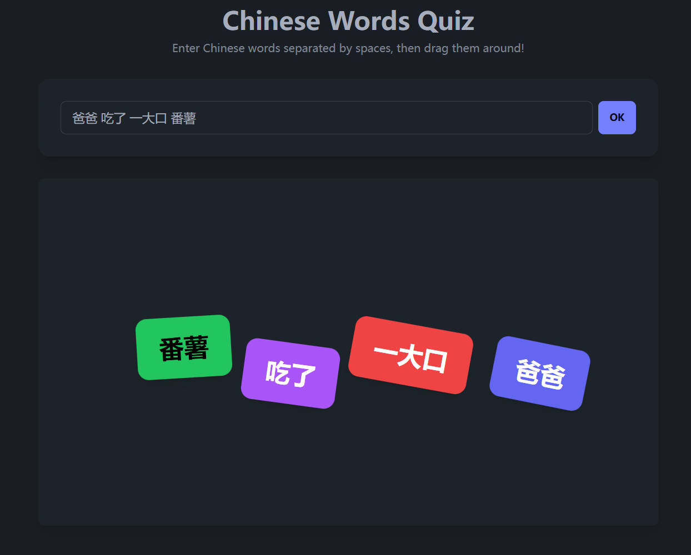

# 🀄 Chinese Words Quiz Game

A delightfully interactive web app that turns Chinese words into colorful, draggable stickers! Perfect for language learners, teachers, or anyone who wants to have fun with Chinese characters.

## ✨ Features

- 🎨 **Rainbow Stickers**: Each word becomes a beautiful colored sticker
- 🎯 **Drag & Drop**: Move your words around the canvas with smooth animations
- 📱 **Mobile Friendly**: Works on both desktop and touch devices
- 🎲 **Random Placement**: Words appear in random positions with slight rotations
- 🎪 **No Setup Required**: Just open and play!

## 🚀 How to Use

1. **Enter Chinese Words**: Type your Chinese words in the input field (separated by spaces)
2. **Click OK**: Watch as your words transform into colorful stickers
3. **Drag Away**: Click and drag any sticker to move it around the canvas
4. **Have Fun**: Arrange your words however you like!

## 🎮 Try It Out

The game comes pre-loaded with sample text: `爸爸 吃了 一大口 番薯` (Dad ate a big bite of sweet potato)

## 🛠️ Technical Details

- **Pure HTML/CSS/JavaScript** - No build process needed
- **Tailwind CSS** + **DaisyUI** for beautiful styling
- **Responsive design** that works on all screen sizes
- **Touch event support** for mobile devices

## 🎯 Perfect For

- 📚 **Language Learning**: Visualize sentence structure
- 🏫 **Teaching**: Interactive classroom activities
- 🎨 **Creative Fun**: Artistic word arrangements
- 🧠 **Memory Practice**: Spatial word association

## 🚀 Get Started

Simply open `index.html` in your web browser and start playing! No installation required.
